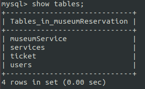
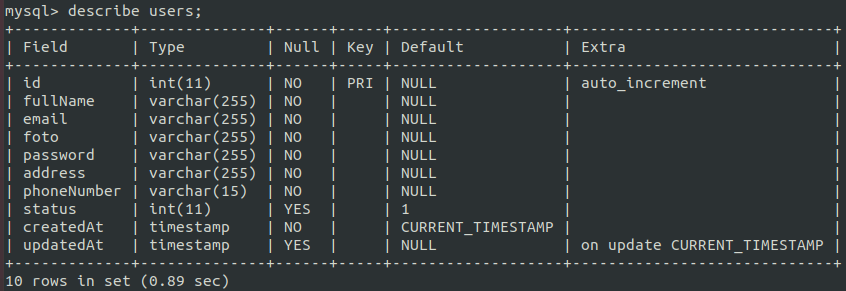
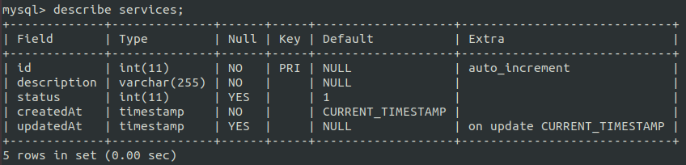
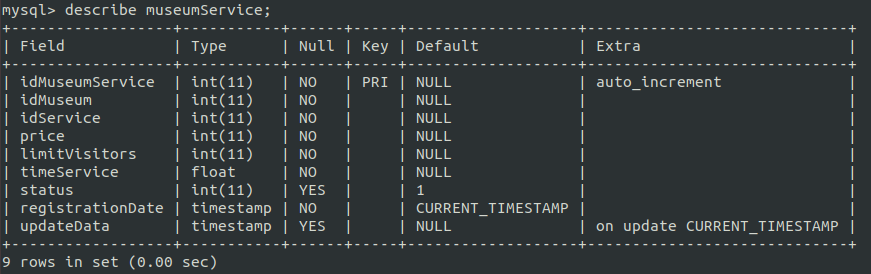
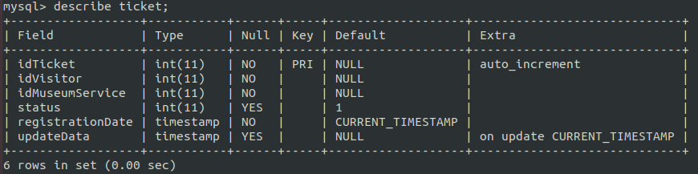

# PROYECTO BEDU
Reservaciones para museos 

## Especificaciones del proyecto 📋
### Nombre del proyecto
Reservaciones para Museos.
### Objetivo principal
Desarrollar  una API que facilite a los museos el control de las personas que ingresan a sus instalaciones por medio de reservaciones, al mismo tiempo que permita a los visitantes reservar su recorrido dependiendo del horario y límite de personas establecido por los museos.
### Tipos de usuario 
Personas que quieran reservar un recorrido en un museo y los museos que quieran tener un control sobre sus visitantes para no exceder el número de personas. Los cuales definimos como:
* Usuario Visitante
* Usuario Museo

### Historias de usuario: 
1. Como usuario visitante, quiero reservar un recorrido de museo
2. Como usuario visitante, quiero ver la lista de museos 
3. Como usuario visitante, quiero ver la información de un museo
4. Como usuario visitante, quiero cancelar una reservación
5. Como usuario museo, quiero editar mi información
6. Como usuario visitante, quiero ver la lista de reservaciones
7. Como usuario museo, quiero crear, editar, listar y eliminar un servicio
8. Como usuario museo, quiero tener un registro de las personas que ingresan a los recorridos. 
9. Como usuario museo, quiero definir el precio, límite de visitantes y servicios que ofrezco. 

### Información que necesitamos
Necesitaremos información sobre:
* Los museos que se registran
* Los servicios que ofrece cada museo
* Límite de visitas por día
* Precio de los recorridos

### Principales entidades
* Usuario visitante
* Usuario museo
* Servicios
* Tickets

### Caracteristicas de las entidades
* Usuario visitante : id, nombre completo, email, foto, contraseña, dirección, teléfono, estado y fecha de registro y actualización.
* Usuario museo: id, idMuseo, idServicio, precio, limite de visitantes, tiempo del servicio, estado, fecha de registro y actualización. 
* Servicios: id, descripción del servicio, estado, fecha de creación y actualización.
* Tikecks: id, idUsuario, idMuseo, estado, fecha de creación y actualización.  

### Funcionalidades de cada usuario

#### Usuarios
Hace referencia a los usuarios que desean realizar una reservación previa a algún museo. Este apartado deriva de usuarios, contiene un status de tipo 1 ,sus acciones son:

* Registrar, visualizar, editar y eliminar perfil
* Consultar y eliminar perfil
* Crear, cancelar y editar reservación
* Visualizar museos
* Visualizar ticket de reservación

#### Museos
Hace referencia a los museos disponibles para realizar una reservación de servicio o recorrido. Este apartado deriva de usuarios, contiene un status de tipo 2, sus acciones son:
* Autenticación
* Editar datos de perfil
* Agregar, visualizar, editar y eliminar servicios
* Agregar, visualizar, editar y eliminar reservaciones

### Tablas y atributos:
#### Tablas

#### Tabla users

* id
* fullname
* email
* photo
* password
* address
* phoneNumber
* status
* createdAt
* updateAt
* teléfono 

#### Tabla services

* id
* description
* status
* createdAt
* updatedAt

#### Tabla museumService

* id
* idMuseum 
* idService
* price
* limitVisitors
* timeService
* status
* createdAt
* updatedAt

#### Tabla ticket

* id
* idVisitor
* idMuseumService
* status
* createdAt
* updatedAt

## Construido con 🛠️

### Tecnologías utilizadas
* Nombre: Node.js
  Version: 10.19.0
* Nombre: Express
  Versión: 6.14..4
* Nombre: MySQL
  Versión: 8.0.23
  
### Dependencias utilizadas:
* bcryptjs 2.4.3
* body-parser 1.19.0
* cors 2.8.5
* dotenv 8.2.0
* express 4.17.1
* express-validator 6.10.0
* jsonwebtoken 8.5.1
* mongoose 5.11.18
* mysql2 2.2.5
* nodemon 2.0.7
* sequelize 6.5.0 

## Integrantes
### Equipo 

Número 20

- Jorge Ivan Gutierrez Yañez
- Diana Yesenia Campos Tenorio
- Daniel Rodríguez López
- Anahi Camas Hernández 
- Damian Susano Martinez 
